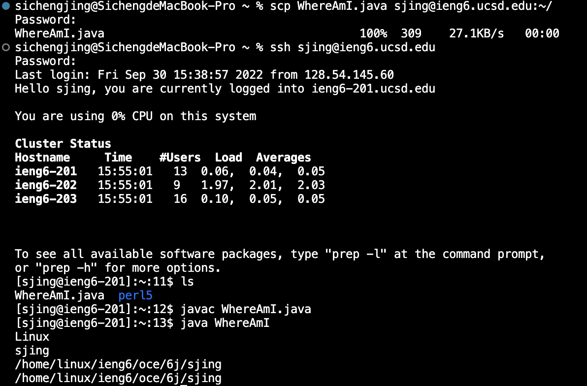

# Week 1 lab report
## Installing VScode
This is the screenshot of VScode open.

## Remotely Connecting
I first opened a terminal in VSCode ( Terminal → New Terminal menu option). After that, I typed in the command ssh cs15lfa22jq@ieng6.ucsd.edu. However, the password didn't work. Therefore, I decided to use my student account to finish the rest of the work. I will figure out this problem later. 

Now, I successfully logged in using my student account. My terminal (client) is connected to the computer in the basement (server). All comments will run on the server.  

## Trying Some Commands

Because I was not logging into cs15lfa22jq, some commands were not working. However, there were still some commands that were working, for example, the ls -a means to display all files and subdirectories in the current directory.

## Moving Files with scp
To copy one local file to the remote, I first made a new file named WhereAmI.java.

Then, I complied and ran it on my computer, and it succeeded.

Then, I typed in the command in the terminal to copy WhereAmI.java into the server. After that, I logged into the server. The output showed that the file was successfully pasted in the remote. 

The outputs are different when running the file on the client and the server. This is because the system environments are different, and getProperty can be used to access the system variable.

## Setting an SSH Key
The ssh-keygen command  eliminates the need to enter a password each time we log in. It will create a public key and a private key. The public key is for the server, and the private key is for the client. 

In this step, I typed in the passphrase instead of empty the first time. The screenshot is from the second trial so there may be some difference. 
As it was shown, the private key (in a file id_rsa) and the public key (in a file id_rsa.pub), were created and stored in the .ssh directory on my computer.
After that, I logged into the server and typed mkdir .ssh to make the directories, and copy the public key to the .ssh directory on the server. Now, my computer has the private key and the server has the public key. 

I logged into the server again and found that the password was not needed anymore. 

## Optimizing Remote Running

At last, I tried some quicker ways to run the commands, and they all worked.
